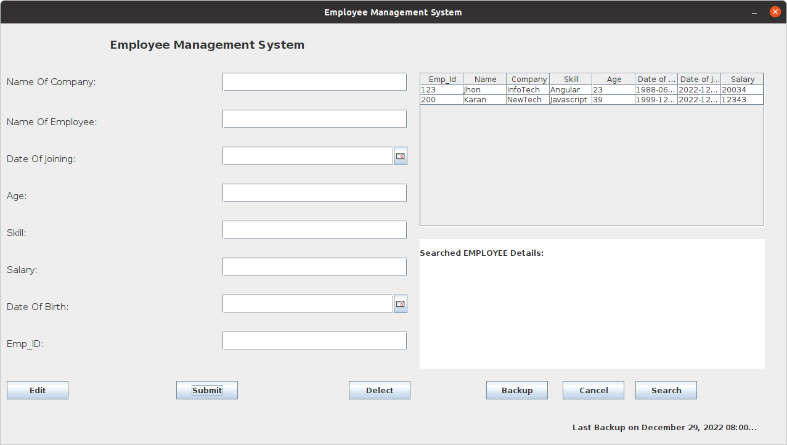
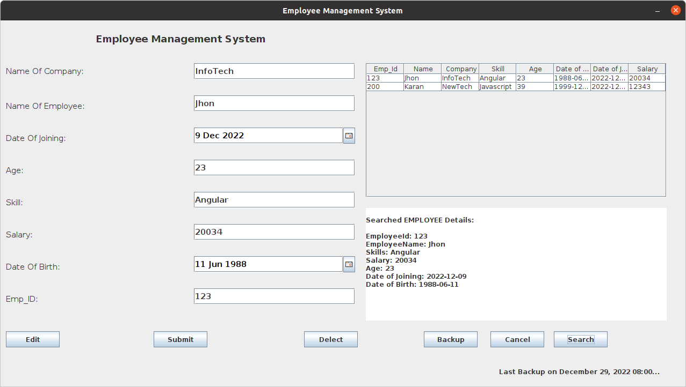

# Employee-Mangement-System

### Employee Management system is a simple java program made by using swing and mysql

This project is created using java swing package for gui and mysql as database

The project contains two folders by default, where:

- `src`: the folder contain source code
- `lib`: the folder contain reference library
- `sql`: the folder to create sql table  

  

  

